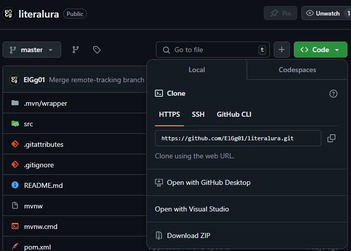
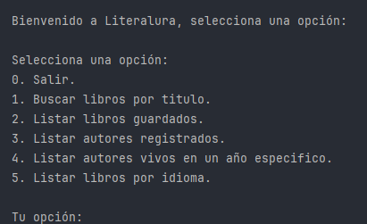

# 📚 Literalura 📚

Literalura es un proyecto desarrollado con Java y Spring que consiste
en consultar una API de libros y guardarlos en una base de datos.

## 🚀 Inicio:

Para obtener una copia de este proyecto pulsa en el botón verde **(<> Code)** y posteriormente puedes obtenerlo de distintas formas, de las cuales solo se explicarán 2:



1. Pulsa al botón **Download ZIP**.
    1. Descomprime el ZIP.
2. Copia el enlace HTTPS: https://github.com/ElGg01/literalura.git
    1. Abre una terminal de comandos en tu sistema operativo.
    2. Teniendo git instalado ejecuta el siguiente comando:
   ```bash
   git clone https://github.com/ElGg01/literalura.git
    ```
## 📋 Prerequisitos:

- ☕ Java:
   - Versión minima necesaria: Desconocida.
   - Versión de desarrollo: JDK 23.0.1.
- 📚 Librerias de Java:
   - Maven.

## 🔧 Instalación:

1. Descarga o clona el proyecto.
2. Crea un archivo en la raíz del proyecto llamado **".env"** con los siguientes datos:
   -  DB_HOST=localhost:puerto
   -  DB_NAME=nombre_bd
   -  DB_USER=usuario_bd
   -  DB_PASSWORD=password_bd
3. Descarga las dependencias necesarias a través de Maven.
4. Ejecutar el archivo "LiteraluraApplication" dentro de: src/main/java/com/elgg/literalura/

## 💵 Modo de uso:
Al ejecutar el programa verás una pantalla como esta:



En la cual podrás elegir varias opciones listadas:

0. Salir: Cierra el programa.
1. Listar libros por titulo: Te pide el titulo de un libro a buscar y si lo encuentre lo guarda en base de datos junto con su autor.
2. Listar libros guardados: Muestra los libros de la base de datos hasta el momento.
3. Listar autores registrados: Muestra todos los autores de los libros que has buscado.
4. Listar autores vivos en un año especifico: Muestra todos los autores que estuvieron vivos en ese año.
5. Listar libros por idioma: Te pide el idioma que puede ser ingles o español por medio de siglas, texto en ingles o en español.

## 👀 Cosas a tener en cuenta:
- Es necesario contar con conexión a internet.
- Las configuraciones de aplication.properties están hechas para una BD de Postgres

## Licencia:
Este proyecto está bajo la licencia MIT. Puedes ver más detalles en el archivo LICENSE.

[MIT LICENSE](LICENSE)

✨ Agredecimiento:
Agradezco a Alura Latam por la formación y apoyo brindados en el desarrollo de este proyecto.

